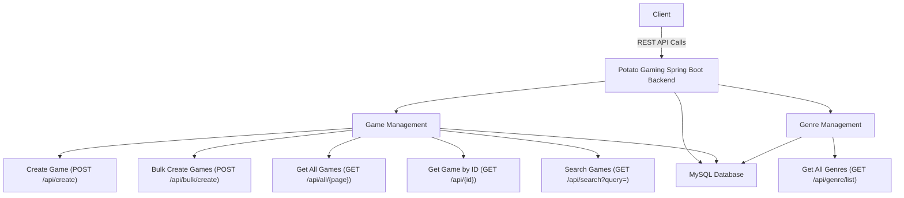
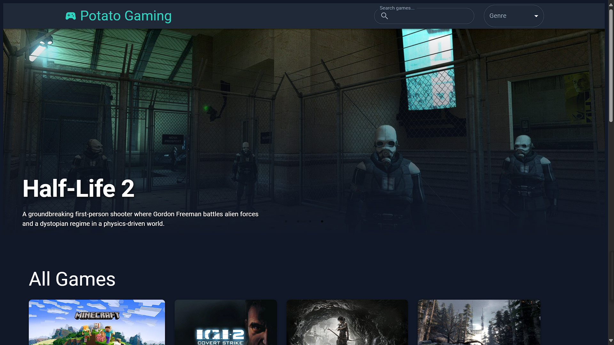
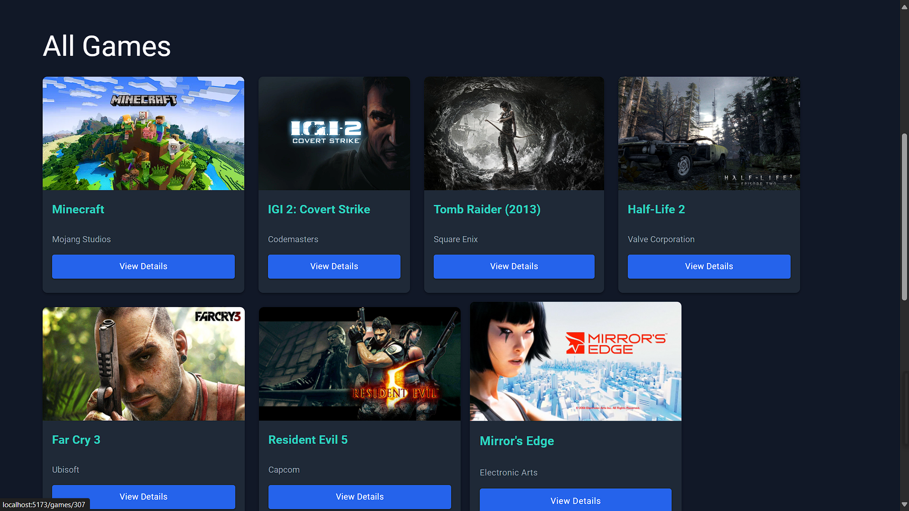
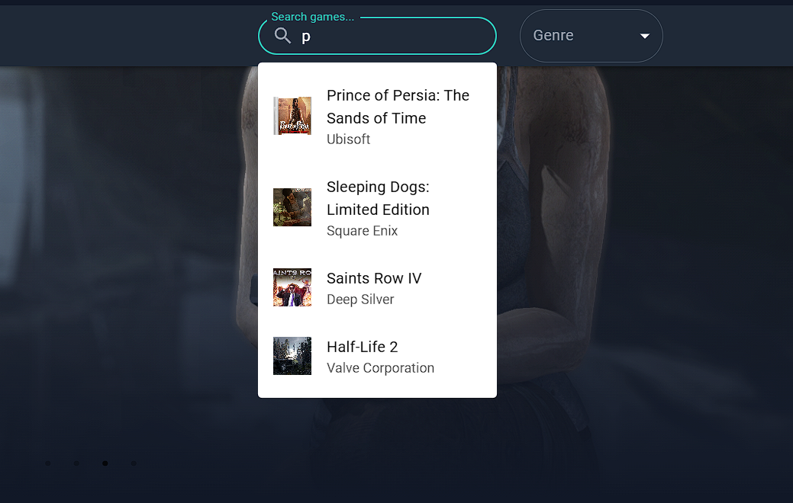
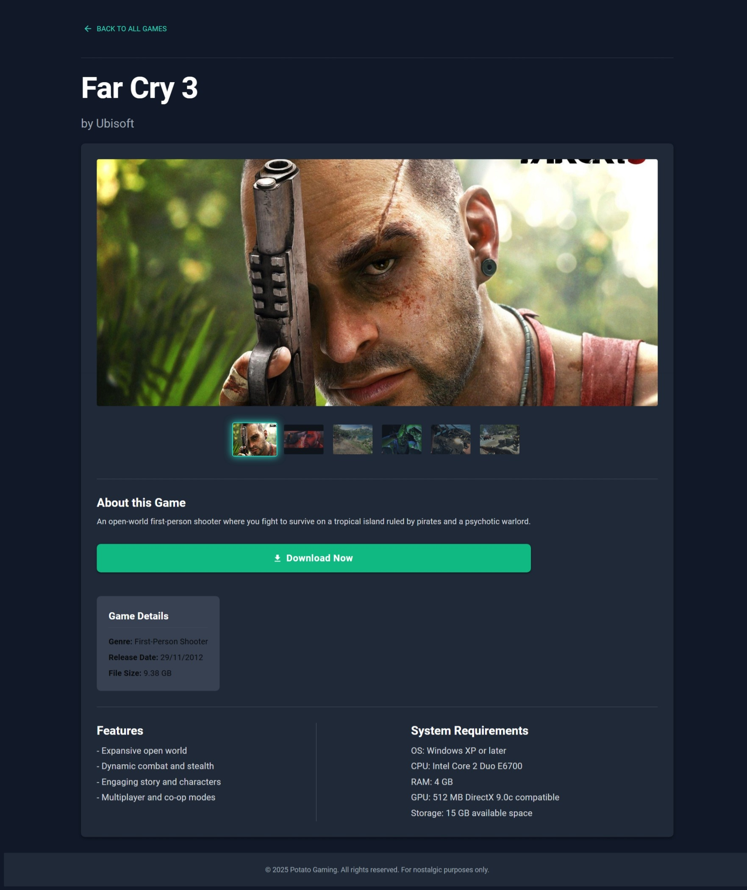

# Potato Gaming 🎮


A robust, backend-focused game download platform (for low end pc's) built with **Spring Boot**. This project powers a modern frontend and demonstrates best practices in REST API design, database modeling, and scalable backend architecture.


---

## 🗺️ API Overview



## 🚀 Features

- **Game Management**: Add, search, and retrieve games with rich metadata, screenshots, and download links.
- **Genre Management**: Organize games by genre, supporting dynamic creation and listing.
- **Advanced Search**: Search games by title, publisher, or genre.
- **Bulk Operations**: Efficiently add multiple games at once.
- **Pagination**: Scalable listing of games for large datasets.
- **Robust Data Modeling**: Uses JPA, Lombok, and MySQL for clean, maintainable code.

---

---

## 📚 API Endpoints

| Method | Endpoint                  | Description                        |
|--------|--------------------------|------------------------------------|
| GET    | `/api/all/{page}`        | Get paginated list of games        |
| GET    | `/api/{id}`              | Get game details by ID             |
| GET    | `/api/genre/list`        | List all genres                    |
| GET    | `/api/search?query=`     | Search games by title/publisher/genre |
| POST   | `/api/create`            | Create a new game                  |
| POST   | `/api/bulk/create`       | Bulk create games                  |

---

## 🏗️ Tech Stack

- **Spring Boot 3**
- **Spring Data JPA**
- **MySQL**
- **Lombok**
- **Maven**

---

## 🗄️ Database Model

- **Game**: title, description, features, publisher, cover image, screenshots, trailer, download links, file size, system requirements, genre, release date.
- **Genre**: name, list of games.

---

## ⚡ Getting Started

1. **Clone the repo**
   ```bash
   git clone https://github.com/yourusername/Potato-Gaming.git
   cd Potato-Gaming
   ```

2. **Configure Database**
    - Set your MySQL credentials in `src/main/resources/application.properties`:
      ```
      spring.datasource.url=jdbc:mysql://localhost:3306/your_db
      spring.datasource.username=your_user
      spring.datasource.password=your_pass
      ```

3. **Build & Run**
   ```bash
   ./mvnw spring-boot:run
   ```

4. **Test the APIs**
    - Use Postman, Swagger UI, or `curl` to interact with the endpoints.

---

## 📸 Screenshots (How it looks)

### 🛍️ HomePage


---

### 🧑‍💻 Fetching All Games (Paginated)


---

### 🔍 Search Api (search games by title, publisher, genre)


---

### 🩻 Fetching Game Details (by id stored in db)


---

### 📦  Multiple Media Embedded (Each game's data conatian trailer, screenshots)


---

## 🧑‍💻 Contributing

Contributions are welcome! Please open issues or pull requests for improvements.

---

## 📄 License

MIT

---

Let me know if you want to add more sections, tweak the style, or include more technical details!
